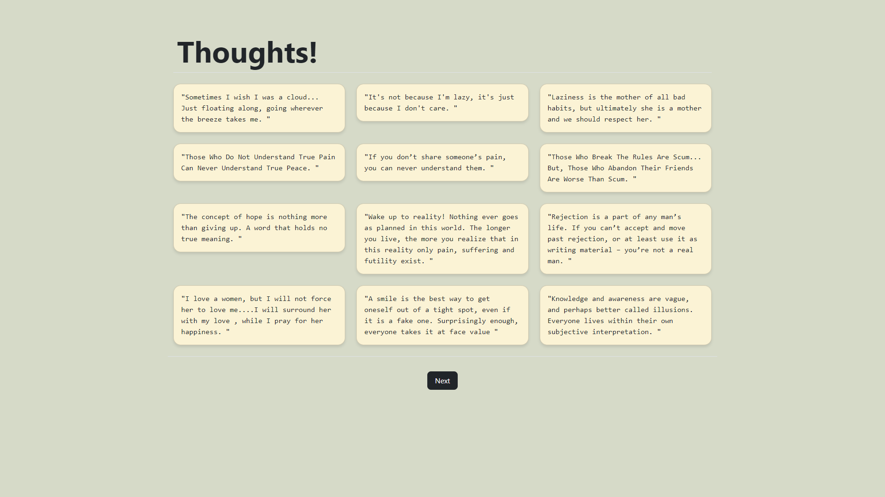

## Random Quotes
To generate a **random quote** from a text file, you can use a random number generator to select a line from the file. By reading the text file line by line and storing each line in an array or list, you can then generate a random index within the range of the array's length. This index will correspond to a randomly chosen quote from the file. You can then display this quote to the user.

*Display initial quotes -*

     for (let i = 0; i < 9; i++) {
      displayRandomQuote();
     }

*Limit the displayed quote to 1000 characters -*
    
    quote.length > 1000

*Auto Dark mode (CSS) -*

    @media (prefers-color-scheme: dark) {
    body {
    background: #000;
    color: #e7f6f2;
     }

    .card {
    background: #000;
    color: #e7f6f2;
    border: 1px solid #ffffff20;
     }
    .card-text {
    background: #000;
    color: #e7f6f2;
     }
    }

---
